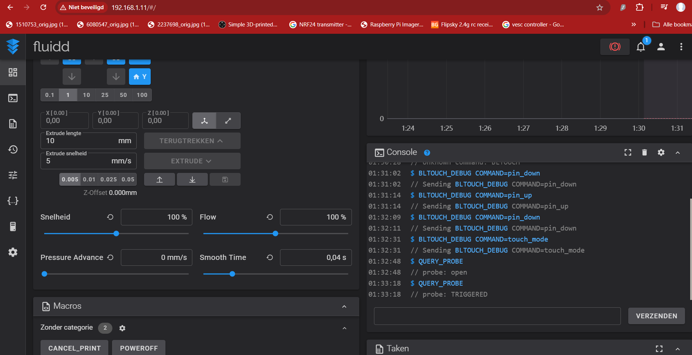
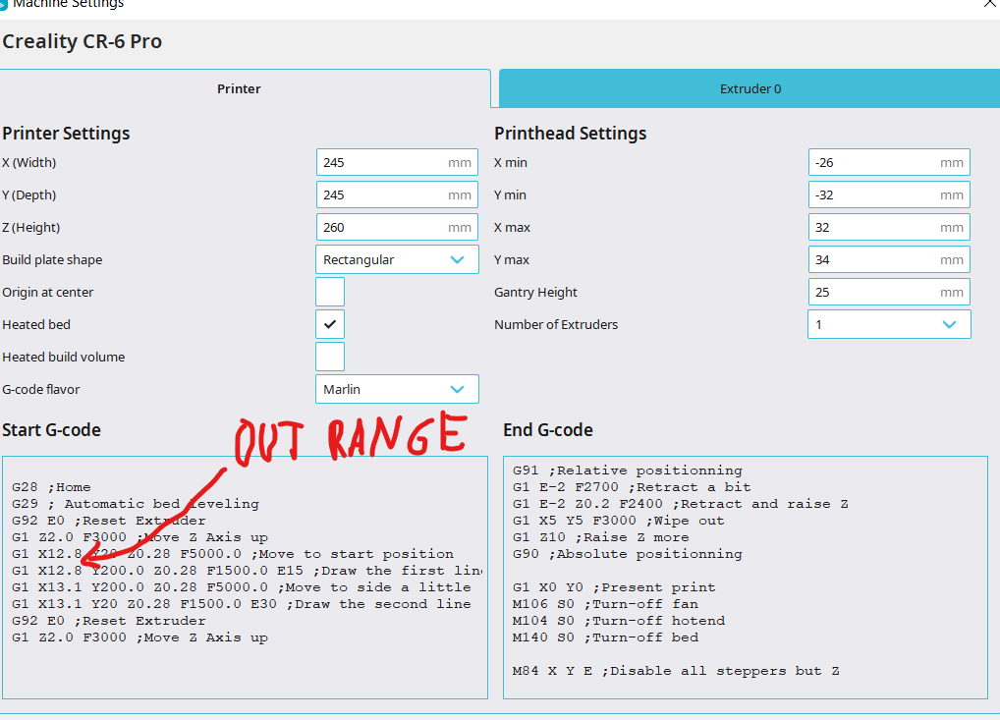

# Klipper Installation for Creality Ender 6

This guide provides step-by-step instructions for installing Klipper firmware on a Creality Ender 6 3D printer. Klipper enhances your 3D printing performance by offloading the printer's processing tasks to a host machine, such as a Raspberry Pi.

## Prerequisites
- **Creality Ender 6**
- **Raspberry Pi (3 or 4 recommended)** i personally like using the pi zero 2 W for this
- **OctoPrint / Fluidd / Mainsail** for Klipper management 
- **USB Cable** for connecting the printer to the Raspberry Pi
- **BL TOUCH** for bed leveling
  

## Installation Steps

1. **Prepare the Raspberry Pi**
   - Install OctoPrint, Mainsail, or Fluidd on the Raspberry Pi to act as the printer's host.
   - Ensure the Pi and Ender 6 are connected via a reliable USB cable.
   - detailed installation guide for Fluiddpi [here](Fluiddpi_Install.md)

2. **Install Klipper**
   - Use the terminal to install Klipper on the Raspberry Pi.
   - Flash the Klipper firmware to your Ender 6 by configuring the printer's microcontroller.
   - check Additional Resources for more info.

3. **Configure Klipper for Ender 6**
   - Customize the `printer.cfg` file based on Ender 6’s specifications.
   - Modify settings like stepper motor configurations, temperature sensors, and max speed.
   - add bl touch in printer.cfg the one i have provided has the correct settings if you are using the Bltouch with the mount i provided. once added i did some bltouch sanity checks to make sure everything worked 
     corrctly
     

4. **Tuning & Testing**
   - Once installed, calibrate your printer’s settings within Klipper, including PID tuning and speed adjustments.
   - Test the setup by printing a calibration object.
5. **issues i encounterd**
    - After installing the BL-Touch on my Micro Swiss extruder, I had to create a custom mount due to the limited space available. To accommodate the BL-Touch, I sacrificed some space on the print bed. This also        required me to relocate the purge line to ensure it remained within the print area.

    - The custom print.cfg file contains specific print parameters. In this file, I had to add the x_min function because I sacrificed some bed space to accommodate the BL-Touch
      

## Additional Resources
- [Original Guide](https://3dprintbeginner.com/how-to-install-klipper-on-creality-ender-6/) 

### Troubleshooting
For any issues encountered during the installation, refer to the troubleshooting section of the guide linked above.

---

Ensure that all cables are securely connected and avoid editing sensitive firmware settings unless you're familiar with Klipper’s configuration.
